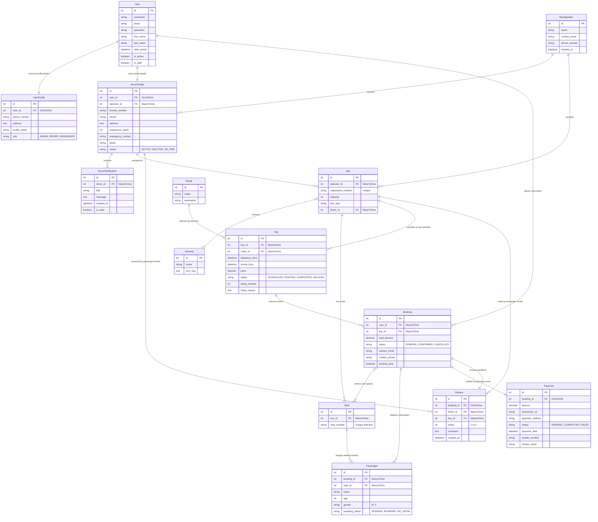

# System Design and Documentation: Bus Ticket Booking and Management System

This document provides a comprehensive technical overview, design, and implementation analysis of the Bus Ticket Booking and Management System, structured for graduation project report requirements.

---

## 4.1 System Overview

The **Bus Ticket Booking and Management System** is a robust, web-based platform designed to digitize and streamline the ticket booking ecosystem. Built on the modern Python-based Django web framework, the system is designed to service three primary user cohorts, ensuring an integrated experience for customers, operators/drivers, and system administrators.

```
                  ┌─────────────────────────────────────────┐
                  │          Bus Ticket Booking System      │
                  └─────────────────────────────────────────┘
                                       │
         ┌─────────────────────────────┼─────────────────────────────┐
         ▼                             ▼                             ▼
   [ Passengers ]                 [ Drivers ]                 [ Admin Panel ]
   • Search Trips                 • View Dashboard            • Manage Users/Roles
   • Interactive Seat Map         • Manage Trip Manifests     • Schedule Trips & Routes
   • Secure Payment Checkout      • Record Boarding Status    • Register Buses & Drivers
   • Submit Ratings & Reviews     • Report Delay Details      • Track Revenue/KPIs
```

### Core Value Proposition & System Operations
1. **Passengers (Customers)**
   - **Trip Discovery**: Passengers can search for trips by origin, destination, and date. Results are refinable using granular filters like departure time ranges (morning, afternoon, evening, night), specific bus operators, and sorting options (price, duration, availability, departure time).
   - **Interactive Booking Flow**: A dynamic seat-mapping grid allows passengers to select precise seat layouts (standardized as a 2+2 layout). After selecting seats, passengers provide individual manifest details (name, age, gender) and primary contact info.
   - **Flexible Payment Integration**: Supports secure, credit card processing via **Stripe Integration (API and Webhooks)**, along with a localized alternative for manual mobile money payments (recording sender names, numbers, and transaction IDs for admin reconciliation).
   - **Feedback System**: Passengers can write reviews and rate buses and drivers on a 1-5 scale once their trip has concluded.

2. **Drivers**
   - **Driver Dashboard**: Provides a dedicated control center for assigned drivers. They can view upcoming and completed trips, manage personal profile details, toggle availability status (Active, Inactive, On Trip), and receive notification messages from administrators.
   - **Trip Operations**: Drivers can view passenger manifest manifests, mark passengers as "Boarded" or "No Show" in real-time, and transition trip statuses from "Scheduled" to "Started" and "Completed".
   - **Real-Time Delays**: Allows drivers to submit delay reports, including delay duration in minutes and reason text, which instantly updates across the passenger-facing site.

3. **System Administrators**
   - **Unified Management Console**: An administrative dashboard presenting key performance indicators (KPIs) such as total revenue, total bookings, active buses/drivers, and overall system ratings. A 7-day interactive chart visualizes historical revenue.
   - **Resource Management**: Complete CRUD operations for routes, scheduled trips, bus operators, driver profiles, registered buses, and user accounts.
   - **Automated Operations**: A background script automatically generates individual seat objects (labeled e.g., 1A, 1B, 1C, 1D) based on a bus's capacity when a bus is registered.
   - **Security and Moderation**: Moderation controls to edit or delete passenger reviews, activate or deactivate accounts, grant staff credentials, and manually override payment and booking statuses.

---

## 4.2 Use Case Diagram

The Use Case Diagram defines the interactions between the system's external actors (Passenger, Driver, System Administrator) and the discrete features (use cases) they invoke.

### Use Case Diagram (Mermaid)

```mermaid
graph TD
    %% Actors definition
    PassengerActor([Passenger])
    DriverActor([Driver])
    AdminActor([System Administrator])

    subgraph User Account Management
        UC_Register[Register Account]
        UC_Login[Authenticate User]
        UC_Profile[Manage User Profile]
    end

    subgraph Passenger Services
        UC_Search[Search Trips]
        UC_Detail[View Trip Details & Seat Map]
        UC_Reserve[Select & Reserve Seats]
        UC_Manifest[Input Passenger Manifest]
        UC_Pay[Process Payment]
        UC_ViewBookings[View Booking History]
        UC_Review[Submit Rating & Review]
    end

    subgraph Driver Portal
        UC_DriverDash[View Driver Dashboard]
        UC_ManifestView[View Passenger Manifest]
        UC_Boarding[Update Boarding Status]
        UC_TripOps[Start/Complete Trip]
        UC_Delay[Report Trip Delay]
        UC_Notify[View Admin Notifications]
    end

    subgraph Administrative Operations
        UC_KPI[Monitor Financial & Operational KPIs]
        UC_ManageRoute[Manage Routes & Trips]
        UC_ManageBus[Manage Buses & Operators]
        UC_GenerateSeats[Auto-Generate Seats]
        UC_ManageDriver[Manage Driver Profiles & Notify]
        UC_ModPayments[Verify Payments & Bookings]
        UC_ModUsers[Manage User Accounts & Permissions]
        UC_ModReviews[Moderate Reviews]
    end

    %% Actor Connections - Passenger
    PassengerActor --> UC_Register
    PassengerActor --> UC_Login
    PassengerActor --> UC_Profile
    PassengerActor --> UC_Search
    PassengerActor --> UC_Detail
    PassengerActor --> UC_Reserve
    PassengerActor --> UC_Manifest
    PassengerActor --> UC_Pay
    PassengerActor --> UC_ViewBookings
    PassengerActor --> UC_Review

    %% Actor Connections - Driver
    DriverActor --> UC_Login
    DriverActor --> UC_Profile
    DriverActor --> UC_DriverDash
    DriverActor --> UC_ManifestView
    DriverActor --> UC_Boarding
    DriverActor --> UC_TripOps
    DriverActor --> UC_Delay
    DriverActor --> UC_Notify

    %% Actor Connections - Admin
    AdminActor --> UC_Login
    AdminActor --> UC_KPI
    AdminActor --> UC_ManageRoute
    AdminActor --> UC_ManageBus
    AdminActor --> UC_GenerateSeats
    AdminActor --> UC_ManageDriver
    AdminActor --> UC_ModPayments
    AdminActor --> UC_ModUsers
    AdminActor --> UC_ModReviews
```



### Detailed Actor & Use Case Descriptions
- **Passenger**: Registration and email activation establish security. Passengers search the system for routes, select specific seats via a bus matrix, and book. Payments trigger status updates from `PENDING` to `CONFIRMED`. Completed trips allow rating submissions.
- **Driver**: Authenticated profiles are created by the administrator. Drivers update their status and drive buses. They access a list of assigned trips, view boarding passenger records, mark passengers as boarded, start/complete trips, and report delays.
- **System Administrator**: The administrative user has authority to monitor the financial performance chart, register new entities (buses, routes, trips), assign drivers to buses, adjust booking statuses, modify payment reports, deactivate accounts, and moderate user reviews.

---

## 4.3 Data Flow Diagram (DFD)

The Data Flow Diagram models how information is routed through the system. It defines the flow of inputs and outputs between users, backend logic processes, and database storage arrays.

### DFD Level 1: System Process Flow (Mermaid)

```mermaid
graph TD
    %% External Entities
    PassengerEntity[Passenger]
    DriverEntity[Driver]
    AdminEntity[System Administrator]
    StripeGateway[Stripe API / Webhook]

    %% Main Process Nodes
    subgraph Processes
        P1[1.0 Authenticate & Profiles]
        P2[2.0 Search & Trip Discovery]
        P3[3.0 Booking Reservation]
        P4[4.0 Payment Settlement]
        P5[5.0 Driver Actions]
        P6[6.0 Administration Console]
        P7[7.0 Rating & Feedback]
    end

    %% Data Stores
    subgraph Data Stores
        DS_Users[(User & Profile DB)]
        DS_Trips[(Trips, Routes & Buses DB)]
        DS_Bookings[(Bookings & Passengers DB)]
        DS_Payments[(Payments DB)]
        DS_Reviews[(Reviews DB)]
        DS_Drivers[(Drivers & Notifications DB)]
    end

    %% 1.0 Auth Flow
    PassengerEntity -->|Registration/Login Data| P1
    DriverEntity -->|Authentication Credentials| P1
    P1 <-->|Verify / Write User Profiles| DS_Users

    %% 2.0 Search Flow
    PassengerEntity -->|Search Parameters: Route/Date| P2
    P2 -->|Read Schedules & Bus Details| DS_Trips
    P2 -->|Display Available Trips| PassengerEntity

    %% 3.0 Booking Flow
    PassengerEntity -->|Select Seats & Passenger Manifest| P3
    P3 -->|Query Bus Layout & Seats| DS_Trips
    P3 -->|Validate Availability / Lock Seats| DS_Bookings
    P3 -->|Redirect to Checkout| PassengerEntity

    %% 4.0 Payment Flow
    PassengerEntity -->|Choose Payment Method| P4
    P4 -->|Initiate Checkout Session| StripeGateway
    StripeGateway -->|Transaction Confirmation| P4
    PassengerEntity -->|Submit Local Mobile Money Receipt| P4
    P4 -->|Write Payment Transaction| DS_Payments
    P4 -->|Update Booking Status: Confirmed| DS_Bookings

    %% 5.0 Driver Flow
    DriverEntity -->|Status Update & Delay Reports| P5
    DriverEntity -->|Boarding manifests adjustments| P5
    P5 <-->|Read Boarding Manifest / Write Status| DS_Bookings
    P5 -->|Update Trip Status & Delay Data| DS_Trips
    P5 <-->|Manage Driver Profiles & Read Inbox| DS_Drivers

    %% 6.0 Admin Flow
    AdminEntity -->|Admin Inputs & Management Actions| P6
    P6 <-->|Read/Write System Accounts| DS_Users
    P6 <-->|Read/Write Trips, Routes & Buses| DS_Trips
    P6 <-->|Override Payment & Booking Records| DS_Bookings
    P6 -->|Write System Notifications| DS_Drivers
    P6 <-->|Moderate & Clean Database| DS_Reviews
    DS_Payments -->|Compile Financial Reports| P6

    %% 7.0 Feedback Flow
    PassengerEntity -->|Submit Feedback| P7
    P7 -->|Write Ratings & Reviews| DS_Reviews
    P7 -->|Read Reviews for Display| DS_Trips
```



---

## 4.4 Database Design (ER Diagram)

The relational schema represents the structural foundation of the system. Relationships enforce constraints, ensuring data integrity across users, buses, schedules, payments, and reviews.

### Entity-Relationship Diagram (Mermaid)



### Relational Schema Detail & Integrity Rules
1. **User Expansion (UserProfile & DriverProfile)**: Users join through Django's core auth `User` model, extended by a 1-to-1 relationship with `UserProfile` (defining role: `ADMIN`, `DRIVER`, `PASSENGER`) and `DriverProfile` (capturing professional license information).
2. **Seating Allocation Integrity**: A composite unique constraint on `Seat` (`bus_id` + `seat_number`) prevents duplicate seats on a single bus.
3. **Double Booking Prevention**: Seating reservations are guarded via views checking against `Booking` instances for a given `Trip` where the status is either `PENDING` or `CONFIRMED`.
4. **Referential Integrity Actions**:
   - `on_delete=models.CASCADE`: Ensures that deleting a `Booking` clean-deletes associated `Passenger` entries.
   - `on_delete=models.SET_NULL`: If a `DriverProfile` is deleted, the `Bus` is not deleted; its driver FK is set to null to avoid data corruption.
5. **Bidirectional State Syncing**: Overridden save logic on the `Payment` and `Booking` models automatically synchronizes statuses (e.g., setting `Payment` status to `COMPLETED` automatically switches the parent `Booking` status to `CONFIRMED` and vice versa).

---

## 4.5 System Implementation

The system is structured as a decoupled, multi-app Django project designed to isolate concerns, support maintainability, and allow scalable extension.

### 4.5.1 Tech Stack
- **Backend Core**: Python 3.10+, Django 6.0.4. Django provides the ORM, routing, secure template rendering engine, validation forms, and built-in CSRF/session security.
- **Database Layer**: SQLite3 database during development (represented by `db.sqlite3` in base workspace), with simple config switches to transition to PostgreSQL in production environments.
- **Frontend Layer**: Semantic HTML5 templates styled using CSS and component styling. Charts are powered by lightweight JavaScript charting libraries.
- **Payment Processing**:
  - **Stripe API**: Process credit cards.
  - **Stripe Webhooks**: Listens for asynchronous transaction signals from Stripe servers to guarantee booking confirmations.
  - **Local Pay Layer**: Custom fields processing local mobile money numbers and reference IDs for manual validation.

### 4.5.2 Project Directory Architecture
The project files are logically structured into the following folders:

```
Ticket-project/
│
├── travel_booking/          # Project configuration directory
│   ├── __init__.py
│   ├── settings.py          # Environment, database, email, Stripe & middleware settings
│   ├── urls.py              # Root URL router mapping to sub-apps
│   └── wsgi.py / asgi.py    # Production server gateway interfaces
│
├── accounts/                # User authentication & registration module
│   ├── models.py            # UserProfile model (roles, address, photo)
│   ├── urls.py              # Account registration, login, logout, and reset routes
│   └── views.py             # User signup, email activation, and profile updates
│
├── listing/                 # Bus operators, vehicles, routes & trips schedules
│   ├── models.py            # BusOperator, Amenity, Bus, Route, Seat, and Trip models
│   ├── urls.py              # Route search and trip detail views paths
│   └── views.py             # Filtered search algorithm and seat availability check
│
├── booking/                 # Seating reservation & passenger manifests
│   ├── models.py            # Booking and Passenger models
│   ├── urls.py              # Passenger details registration page mapping
│   └── views.py             # Multi-step booking handler and session management
│
├── payments/                # Online (Stripe) and local mobile payment flows
│   ├── models.py            # Payment model (status, transaction_id, provider)
│   ├── urls.py              # Stripe session paths, mock checkouts, and local payment inputs
│   └── views.py             # Stripe API integration, webhook endpoints, and local submissions
│
├── reviews/                 # Post-trip passenger feedback module
│   ├── models.py            # Review model (linking bookings, buses, drivers)
│   ├── urls.py / forms.py   # Review creation forms and endpoint mapping
│   └── views.py             # Review validation logic (verifies complete status)
│
├── driver/                  # Dedicated portal for assigned driver actions
│   ├── models.py            # DriverProfile status values and notification logs
│   ├── urls.py / forms.py   # Driver delay forms and operations endpoints
│   └── views.py             # Boarding management and active trip state controllers
│
├── system_admin/            # Comprehensive administrative system management panel
│   ├── decorators.py        # Custom @admin_required permission logic
│   ├── forms.py             # Tailwind-styled CRUD forms for buses, routes, drivers
│   ├── urls.py              # Dashboard routes mapping all actions
│   └── views.py             # Operational controllers & financial statistics generators
│
├── templates/               # Global templates directory
│   └── base.html            # Main site frame containing header, navigation, and footer
│
├── db.sqlite3               # Core relational storage database file
├── manage.py                # Django CLI execution utility script
└── .env                     # Configuration keys (Stripe details, SMTP credentials)
```

---

## 4.6 Screenshots / Modules Explanation

This section explains the visual features and operational logic of each system module. It serves as a guide for capturing screenshots from the running system for inclusion in project reports.

### 4.6.1 Module 1: User Authentication & Accounts
* **Registration & Activation Screen**: 
  - *Purpose*: Registers user accounts. It features input fields for Username, Email address, and Password verification.
  - *System Logic*: Submitting the form validates that the username/email are unique. It flags the account as inactive and dispatches an activation link to the user's email address using Django's SMTP backend. The registration process remains pending until the user verifies their email.
  - *Activation Page*: Once the activation URL (containing cryptographic tokens) is clicked, the system activates the account and routes the passenger to the login page.
* **Login & Profiles Screen**: 
  - *Purpose*: Authenticates users. It provides fields for credentials, error warning states, and password reset flows.
  - *Profile View*: Authenticated users can view their contact data, upload a profile photo, update names, edit their email address, and view details about their booking histories.

---

### 4.6.2 Module 2: Passenger Trip Search & Seat Reservation
* **Landing Page Search Engine**:
  - *Purpose*: The homepage for discovering bus schedules.
  - *Key Visuals*: Dropdown search inputs for Origin and Destination routes, along with a calendar departure date selector.
  - *System Logic*: Queries database records to output distinct values from the `Route` database table to populate search dropdown inputs.
* **Search Results & Dynamic Filters**:
  - *Purpose*: Displays matching trip results.
  - *Key Visuals*: A sidebar with filter options for Departure Times (Morning, Afternoon, Evening, Night) and Bus Operators. Sorting buttons order trips by Price, Duration, Arrival Time, and Available Seats. 
  - *System Logic*: Backend filtering logic utilizes `Q` query operations to apply filter arguments. It calculates available seat numbers in real-time, displaying card listings that include operator names, pricing, timings, trip duration, and available seat counts.
* **Interactive Seat Selection Grid**:
  - *Purpose*: Displays bus seat maps.
  - *Key Visuals*: A grid of seats mimicking a 2+2 layout. Booked seats are color-coded (red) and disabled. Available seats are color-coded (green/blue) and clickable. 
  - *System Logic*: Renders the seat layout dynamically. Form submissions validate selections on the server to prevent double-booking, saving chosen seat IDs in session variables before directing the user to the manifest form.

---

### 4.6.3 Module 3: Booking Manifest & Payment Settlement
* **Passenger Manifest Registry**:
  - *Purpose*: Records passenger details.
  - *Key Visuals*: Dynamically renders form sections matching the count of selected seats. Each seat has input fields for Passenger Name, Age, and Gender.
  - *System Logic*: Saves passenger records associated with the pending reservation and calculates the total booking cost.
* **Payment Selector & Stripe Integration**:
  - *Purpose*: Allows users to choose their payment method.
  - *Key Visuals*: Option cards for Card Payments (Stripe) and Local Payments.
  - *Stripe Flow*: Routes users to a secure Stripe Checkout portal. Successful transactions return a confirmation token via Stripe Webhooks, updating the booking status to `CONFIRMED`.
  - *Mock Checkout Page*: In development mode, a mock checkout simulator is provided. This screen displays booking details, total cost, and a confirmation button that simulates successful transactions.
* **Local Payment Gateway Form**:
  - *Purpose*: Supports manual payment submissions.
  - *Key Visuals*: Input fields for Sender Mobile Number, Sender Registered Name, Transaction reference ID, and payment provider options.
  - *System Logic*: Saves payment details with a `PENDING` status. The booking remains pending until an administrator verifies the receipt and updates the status.

---

### 4.6.4 Module 4: Driver Control Portal
* **Driver Dashboard Overview**:
  - *Purpose*: The driver's homepage.
  - *Key Visuals*: Summary panels displaying total assigned buses, upcoming trips count, and completed trips. Drivers can toggle their active status (Active, Inactive, On Trip) and view system notifications.
* **Passenger Manifest & Boarding Controller**:
  - *Purpose*: Tracks passenger boarding status in real-time.
  - *Key Visuals*: Interactive passenger list detailing name, seat number, and boarding status (Pending, Boarded, No Show). Action buttons allow drivers to update boarding states, start the trip, or mark it as completed.
  - *System Logic*: Locks status modifications once a trip is completed. Starting a trip updates the driver's status to `ON_TRIP` and creates a notification record.
* **Report Delay Screen**:
  - *Purpose*: Reports trip delays.
  - *Key Visuals*: Input fields for delay duration in minutes and delay reason.
  - *System Logic*: Updates the database fields on the `Trip` model. This propagates status updates across passenger searches and records driver logs.

---

### 4.6.5 Module 5: Administrative Dashboard
* **Admin Overview Panel**:
  - *Purpose*: High-level operations monitoring.
  - *Key Visuals*: KPI metrics displaying Total Revenue, Total Bookings, Active Drivers, Active Buses, and Average Rating. A 7-day revenue chart visualizes daily earnings.
* **Bus & Auto-Seat Generator Form**:
  - *Purpose*: Adds new buses and auto-generates seat maps.
  - *Key Visuals*: Registration form (Operator select, Reg Number, Capacity, Bus Type, Amenities, Driver select).
  - *System Logic*: A post-save algorithm automatically populates the `Seat` database table with distinct seat numbers based on the bus's capacity (e.g., 40 seats generates 1A-10D).
* **Driver Registry & Notification Dispatcher**:
  - *Purpose*: Driver profile management.
  - *Key Visuals*: Profiles management list and custom message input boxes.
  - *System Logic*: Creating a driver profile links them to an existing user account, grants them appropriate access permissions, and assigns them to a bus operator.
* **Payments & Bookings Ledger Moderation**:
  - *Purpose*: Operational management ledger.
  - *Key Visuals*: Booking entries, filter options, detail views, and action buttons to approve or cancel payments.
  - *System Logic*: Modifying payment records automatically syncs booking statuses. This handles local payment processing, refunds, and cancellations.
* **Reviews Moderation Control**:
  - *Purpose*: User feedback moderation.
  - *Key Visuals*: List of reviews displaying passenger details, rating stars, comments, and delete buttons.
  - *System Logic*: Allows administrators to remove inappropriate reviews, which automatically updates ratings for buses and drivers.
